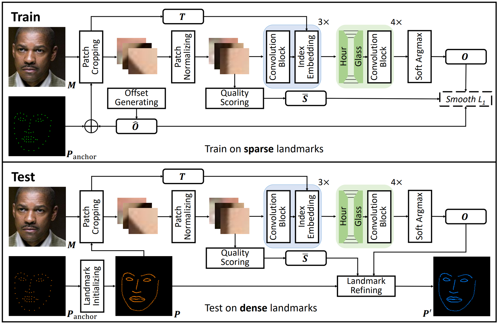

# FreeEnricher: Enriching Face Landmarks without Additional Cost

Paper link: [AAAI 2023](https://arxiv.org/pdf/2212.09525.pdf)

Updated: 12/20/2023

## Resources

| Dataset          | Dataset                                                            | Metadata (train, test)| Description    |
| :--------------- | :----------------------------------------------------------------- | :-------------------- | -------------- |
| Enriched 300W    | [official](https://ibug.doc.ic.ac.uk/resources/300-W/)             | [google](https://drive.google.com/drive/folders/1X8img5yRyLXV2cBxtbWuCOsNKVQMz1Sm?usp=share_link) / [baidu](https://pan.baidu.com/s/1GOGSpn3PQEYHf23r4eEBHA?pwd=6czg)  | The metadata contains both train.tsv and test.tsv, where train.tsv is refined by FreeEnricher and test.tsv is manually labeled. |
| Enriched WFLW    | [official](https://wywu.github.io/projects/LAB/WFLW.html)          | [google](https://drive.google.com/drive/folders/1egD-fQjfcPoU7daMAQNFxh434Ijz7jLV?usp=share_link) / [baidu](https://pan.baidu.com/s/1NddBa8GIeI8cEADq5XNBSg?pwd=1yme)  | The metadata only contains train.tsv, where train.tsv is refined by FreeEnricher.                                               |

## Structure
| Folder           | Description                                                            |
| :----------------| :--------------------------------------------------------------------- |
| ADNet            | The ADNet codebase of training and testing.                            |
| conf             | The enriched version configure files.                                  |

## Preparation
 - Step1: Clone and Install [ADNet](https://github.com/huangyangyu/ADNet/tree/7f9268449d1605c2f5a00495b93c942f28cd8ac8).
 - Step2: Replace the conf file of [ADNet](https://github.com/huangyangyu/ADNet/tree/7f9268449d1605c2f5a00495b93c942f28cd8ac8) with [enriched version](./conf/alignment.py).
 - Step3: Download dataset and metadata of each dataset to data/alignment/*${dataset}* folder.
 - Step4: Set the target dataset through configuring the *${data_definition}* variable in conf/alignment.py script.
 - Step5: Run the scripts in [ADNet](https://github.com/huangyangyu/ADNet/tree/7f9268449d1605c2f5a00495b93c942f28cd8ac8).

## Framework
The framework of FreeEnricher.

## Performance
Table 1. Performance of our method on enriched **300W**.

| Method    | Network       | NMEpoint | NMEedge |
| --------- | ------------- | ------------------- | ------------------ |
| Baseline  | ADNet + Line5 | 3.21                | 1.18               |
| **Ours**  | **ADNet-FE5** | **3.06**            | **0.98**           |

Table 2. Comparing with state-of-the-art methods on original **300W** and **WFLW**.

| Method        | 300W           | WFLW           |
| ------------- | -------------- | -------------- |
| LAB           | 3.49           | 5.27           |
| HRNet         | 3.34           | 4.60           |
| LUVLi         | 3.23           | 4.37           |
| ADNet         | 2.93           | 4.14           |
| **ADNet-FE5** | **2.87**       | **4.10**       |

## Citation

TBD

## License

    The project is released under the MIT License